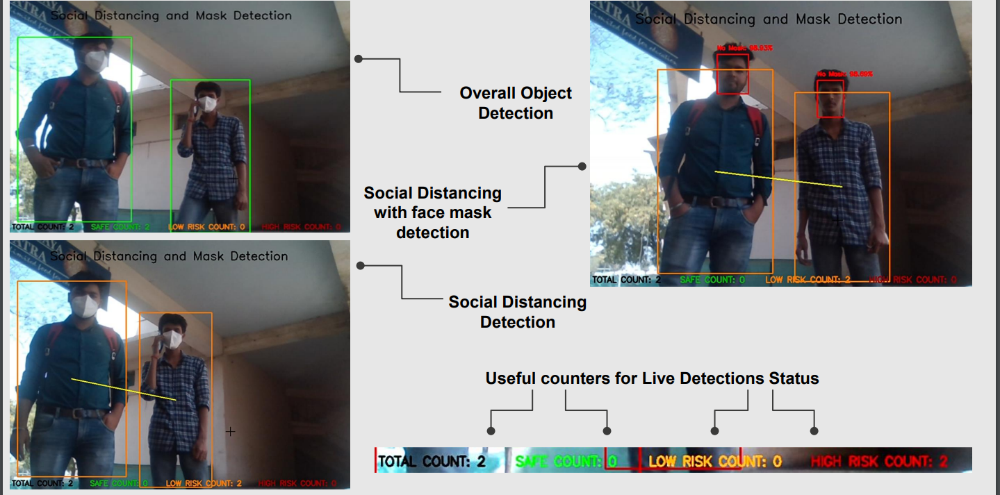

# Real-time-social-distancing-and-mask-detection
## with interactive voice commands and clothes coloring detection


[](https://youtu.be/9u4jOUY6Wkc)

[](https://drive.google.com/file/d/12_GViakrY_oYGyBLI0BP9oTWFDIhLT14/view?usp=sharing)

This Project uses `tensorflow` / `Keras` and Other Python ML libraries. (`OpenCV`, `Numpy`....)
## Funtionalities
-> Real time Social distancing detection
-> Real time mask detection
-> Voice Commands: eg: (Please maintain the social distancing)
-> Cloth color detection: eg: (You in Red Colored Clothes, Please wear your mask.

### Used predefined object detection models of Yolo

## Algorithms Used:

1. Convolutional Neural Network (ConvNet/CNN)
2. K-Nearest Neighbours (KNN)

Use:
(after installing python and useful libraries used in the project

Run This Project:

```bash
  python main.py
```
